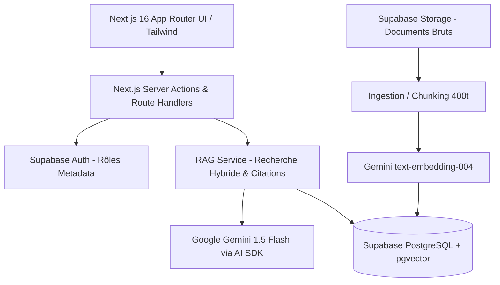

# Architecture Spine — NexaMind AI

## Design Paradigm
Architecture en couches modulaires pour application RAG web fullstack :
- **Couche Présentation :** Next.js 16 App Router (Client & Server Components) + Tailwind CSS.
- **Couche Domaine / RAG Core :** Extraction, chunking (400-500 tokens) et recherche sémantique.
- **Couche Infrastructure :** Supabase (PostgreSQL + pgvector + Auth + Storage) et Google Gemini via le Vercel AI SDK.



## Invariants & Rules

### AD-1 — RAG Groundedness & Abstention [ADOPTED]
- **Binds:** FR-10, FR-11, FR-12, R-4
- **Prevents:** Hallucination du modèle ou réponses fabriquées sans source documentaire.
- **Rule:** Le prompt système du LLM impose strictement de répondre uniquement à partir des chunks injectés dans le contexte. Si la similarité cosinus maximale des chunks retrouvés est inférieure au seuil de 0.65 (ou si le contexte ne permet pas de répondre), l'assistant doit renvoyer la phrase d'abstention standard sans inventer de faits.

### AD-2 — Séparation stricte des Rôles et Droits d'Ingestion [ADOPTED]
- **Binds:** FR-5, FR-7, R-5
- **Prevents:** Téléversement ou suppression non autorisée de documents par un utilisateur non-administrateur.
- **Rule:** L'accès à la route d'upload et aux mutations de suppression vérifie le rôle `admin` dans `user_metadata` à la fois côté serveur Next.js et via les politiques RLS (Row-Level Security) PostgreSQL de Supabase.

### AD-3 — Découpage Documentaire (Chunking) & Indexation Vectorielle [ADOPTED]
- **Binds:** FR-6, FR-9
- **Prevents:** Chunks trop longs diluant l'information ou trop courts perdant le contexte.
- **Rule:** Le découpage documentaire s'effectue par blocs de 400 à 500 tokens avec un chevauchement (overlap) de 50 tokens, en conservant le titre du document dans chaque chunk. Le modèle d'embedding est fixé à `text-embedding-004` (768 dimensions).

### AD-4 — Sécurité des Clés & Découplage Client/Serveur [ADOPTED]
- **Binds:** FR-3, §6 (Sécurité)
- **Prevents:** Exposition des clés d'API secrètes (Gemini API Key, Supabase Service Role Key) côté navigateur.
- **Rule:** Aucune clé secrète ne doit figurer dans des variables préfixées par `NEXT_PUBLIC_`. Tous les appels d'embedding, de requêtage vectoriel et de génération IA transitent exclusivement par les Server Actions ou Route Handlers Next.js.


## Consistency Conventions

| Préoccupation | Convention retenue |
| --- | --- |
| Schéma de base de données | Tables au pluriel (`resources`, `document_chunks`, `conversations`, `messages`) en snake_case. |
| Clés primaires | Identifiants universels UUID v4 (`id uuid default gen_random_uuid()`). |
| Dates et horodatage | UTC ISO-8601 (`created_at timestamptz default now()`). |
| Retours d'erreurs RAG | Objet JSON unifié `{ success: boolean, data?: T, error?: string, code?: string }`. |
| Citations de sources | Tableau structuré `{ sourceId: string, title: string, chunkId: string, excerpt: string }`. |

## Stack

| Nom | Version / Spécification |
| --- | --- |
| Framework Web | Next.js 16.3.6 (App Router + Turbopack) |
| Runtime & Typage | Node.js v24 LTS + TypeScript 5.9 |
| Base de Données & Vecteurs | Supabase PostgreSQL 15+ avec extension `pgvector` |
| Authentification | Supabase Auth (Session SSR avec cookies `HttpOnly`) |
| Stockage de fichiers | Supabase Storage (Bucket privé `documents`) |
| Fournisseur IA & SDK | `@ai-sdk/google` (Vercel AI SDK v4+) |
| Modèle de Génération | `gemini-1.5-flash` (streaming activé) |
| Modèle d'Embeddings | `text-embedding-004` (768 dimensions) |
| Stylisation UI | Tailwind CSS v4 (aligné sur les tokens de `DESIGN.md`) |

## Structural Seed

```text
app/
  (auth)/
    login/page.tsx             # Écran d'authentification
    register/page.tsx          # Écran d'inscription
  (dashboard)/
    page.tsx                   # Tableau de bord unifié
    chat/
      page.tsx                 # Nouveau chat assistant
      [id]/page.tsx            # Conversation existante
    search/page.tsx            # Recherche documentaire
    admin/
      resources/page.tsx       # Dépôt & gestion documentaire (Admin)
  api/
    chat/route.ts              # Route de streaming RAG LLM
    ingest/route.ts            # Route d'ingestion & chunking
lib/
  supabase/
    client.ts                  # Client Supabase navigateur
    server.ts                  # Client Supabase serveur (cookies)
  ai/
    gemini.ts                  # Client Vercel AI SDK Google
    embedding.ts               # Génération de vecteurs (768d)
    chunking.ts                # Découpage de texte (400-500 tokens)
components/
  chat/                        # Bulles, saisie, tiroir de citations
  dashboard/                   # Métriques, raccourcis
  resources/                   # Liste, téléversement de fichiers
  ui/                          # Boutons, badges, cartes conformes DESIGN.md
```

## Capability → Architecture Map

| Exigence PRD | Composant technique | Règle / Invariant |
| --- | --- | --- |
| Authentification & Sécurité (`FR-1` à `FR-3`) | Supabase Auth SSR + Middleware Next.js | AD-2, AD-4 |
| Tableau de bord (`FR-4`) | `app/(dashboard)/page.tsx` + Server Components | DESIGN.md |
| Dépôt & Ingestion (`FR-5`, `FR-6`) | `app/api/ingest/route.ts` + `lib/ai/chunking.ts` | AD-2, AD-3 |
| Gestion documentaire (`FR-7`) | `app/(dashboard)/admin/resources/` + RLS | AD-2 |
| Recherche (`FR-8`, `FR-9`) | Fonction SQL RPC Supabase `match_chunks` | AD-3 |
| Assistant RAG & Citations (`FR-10` à `FR-13`) | `app/api/chat/route.ts` + `lib/ai/gemini.ts` | AD-1, AD-4 |
| Résumé automatique (`FR-14`) | Server Action avec prompt direct Gemini 1.5 Flash | AD-4 |
| Historique (`FR-15`, `FR-16`) | Tables Supabase `conversations` et `messages` | AD-4 |

## Deferred
- Mise en cache Redis / Upstash des requêtes fréquentes (déférée en v2).
- Évaluation automatique en temps réel des réponses RAG (Ragas / Langfuse) : audit manuel sur jeu de test suffisant pour le MVP.
- Connecteurs automatiques externes (Google Drive, Notion) : exclu par le PRD.
